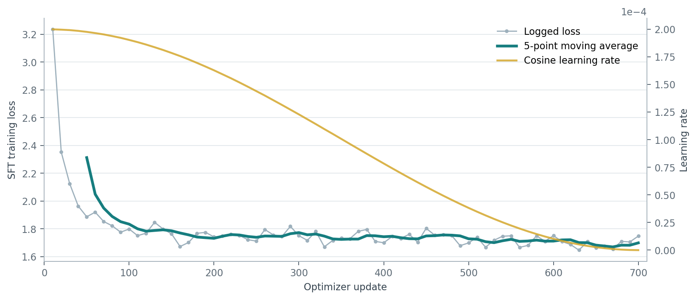
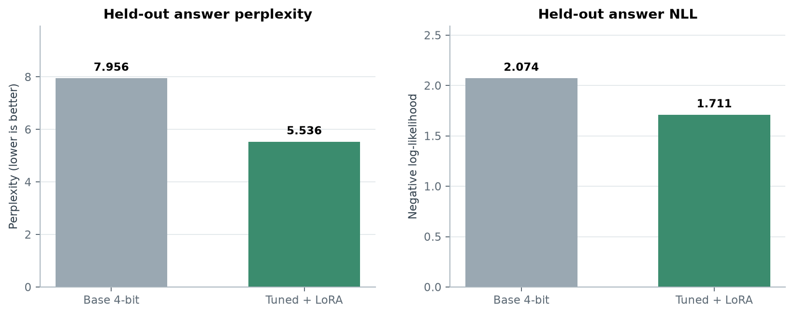
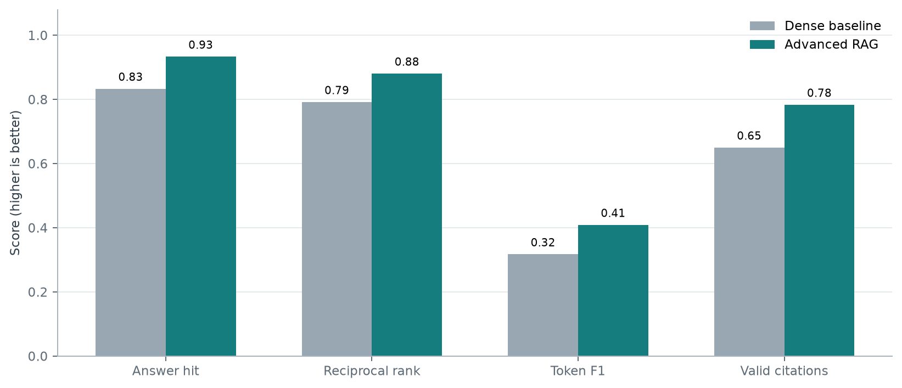
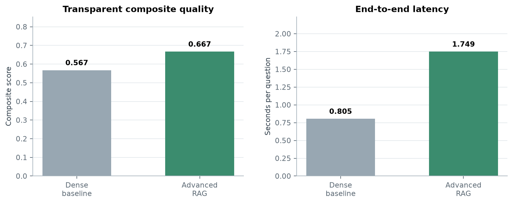
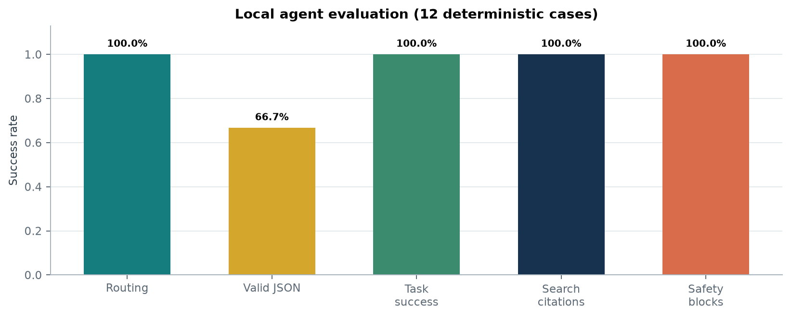
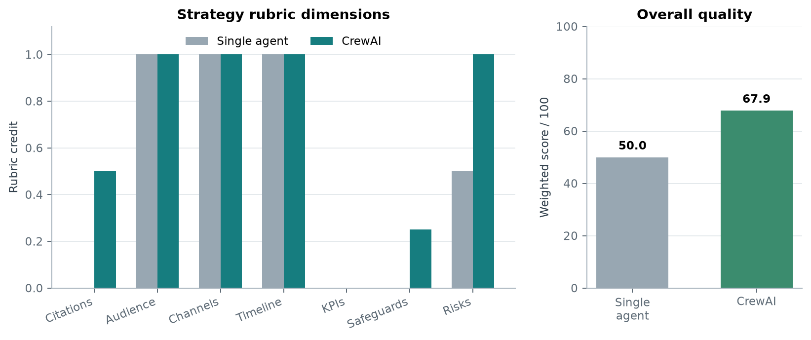

# AI Project Artifacts

Three reproducible portfolio projects covering LLM fine-tuning, retrieval-augmented
generation, and tool-using multi-agent systems. The notebooks are designed for a
Google Colab A100 runtime and emphasize controlled comparisons, measurable results,
safety boundaries, and documented engineering tradeoffs.

> **Version:** ver 1.2.1: larger figures and math fixes 
> **Updated:** 2026-07-30 02:43 EDT

## Portfolio Summary

| Project | Primary goal | Main comparison | Measured result | Judgment |
| --- | --- | --- | --- | --- |
| 1. LLM Fine-Tuning | Adapt Llama 3 8B to software-engineering answers with parameter-efficient training | Base model vs. QLoRA adapter | Held-out answer perplexity decreased **30.42%**, from 7.9560 to 5.5359 | Strong evidence of better fit to the target answer distribution; not yet proof of factual or production quality |
| 2. RAG Document QA | Improve grounded QA over a real Wikipedia corpus | Dense baseline vs. HyDE + hybrid retrieval + reranking | Composite score increased **17.55%**, from 0.5674 to 0.6669 | Better retrieval, answer overlap, and citation validity, with higher retrieval latency |
| 3. LLM Agent System | Build auditable local tools and a role-based business workflow | Single agent vs. CrewAI workflow | Agent task success was **100%** on 12 cases; CrewAI strategy score improved **35.71%** | Typed tools and fallbacks were reliable; multi-agent quality improved at a substantial latency cost |

## Repository Map

### Shared Files

| File | Purpose |
| --- | --- |
| [`ai_projects_guideline.pdf`](ai_projects_guideline.pdf) | Step-by-step implementation guide, commands, code, and source links for all three projects |
| [`ai_metrics_and_explanations.pdf`](ai_metrics_and_explanations.pdf) | Explanation of the resume improvement claims and concise behavioral interview answers |
| [`project_debug_log.md`](project_debug_log.md) | Symptoms, root causes, fixes, affected cells, and verification notes from development |
| [`background/`](background/) | Graduate-level explanations of the concepts, mathematics, evaluation methods, and tradeoffs behind each project |
| [`tools/`](tools/) | Report generators and reproducible notebook-update utilities |
| [`.gitignore`](.gitignore) | Excludes local dependencies, caches, temporary renders, secrets, and local helper files |
| [`.gitattributes`](.gitattributes) | Marks PDF and PNG artifacts as binary Git content |

### Project 1 Files

| File | Purpose |
| --- | --- |
| [`01_llm_fine_tuning_pipeline.ipynb`](01_llm_fine_tuning_pipeline.ipynb) | Executed data preparation, LLaMA-Factory QLoRA training, evaluation, and serving notebook |
| [`background/project1_background.md`](background/project1_background.md) | Concepts behind SFT, LoRA/QLoRA, GPU-efficient training, perplexity, and paired evaluation |
| [`tools/generate_project1_report.py`](tools/generate_project1_report.py) | Rebuilds the Project 1 PDF and charts from saved notebook outputs |
| [`output/project1/project1_report.pdf`](output/project1/project1_report.pdf) | Portfolio report with architecture, data quality, training, evaluation, and limitations |
| [`output/project1/project1_report_assets/data_quality.png`](output/project1/project1_report_assets/data_quality.png) | Dataset cleaning and split visualization |
| [`output/project1/project1_report_assets/training_dynamics.png`](output/project1/project1_report_assets/training_dynamics.png) | Training-loss visualization |
| [`output/project1/project1_report_assets/evaluation_comparison.png`](output/project1/project1_report_assets/evaluation_comparison.png) | Base-versus-tuned evaluation chart |

### Project 2 Files

| File | Purpose |
| --- | --- |
| [`02_rag_document_qa_system.ipynb`](02_rag_document_qa_system.ipynb) | Executed baseline and advanced RAG experiment |
| [`background/project2_background.md`](background/project2_background.md) | Concepts behind chunking, dense/BM25 retrieval, HyDE, RRF, reranking, citations, and QA metrics |
| [`tools/update_project2_notebook.py`](tools/update_project2_notebook.py) | Reproducible notebook construction and update script |
| [`tools/generate_project2_report.py`](tools/generate_project2_report.py) | Rebuilds the Project 2 report from notebook result markers |
| [`output/project2/project2_report.pdf`](output/project2/project2_report.pdf) | Portfolio report with architecture, evaluation design, results, and caveats |
| [`output/project2/project2_final_summary.json`](output/project2/project2_final_summary.json) | Final seed-2026 metrics and experiment configuration |
| [`output/project2/project2_representative_samples.json`](output/project2/project2_representative_samples.json) | Representative baseline and advanced answers |
| [`output/project2/project2_seed42_development_summary.json`](output/project2/project2_seed42_development_summary.json) | Preserved development-run evidence used to diagnose prompt verbosity |
| [`output/project2/project2_report_assets/quality_metrics.png`](output/project2/project2_report_assets/quality_metrics.png) | Per-metric baseline and advanced comparison |
| [`output/project2/project2_report_assets/score_latency_tradeoff.png`](output/project2/project2_report_assets/score_latency_tradeoff.png) | Composite-quality and latency comparison |

### Project 3 Files

| File | Purpose |
| --- | --- |
| [`03_llm_agent_system.ipynb`](03_llm_agent_system.ipynb) | Executed LangChain, MCP-style tool, and CrewAI workflow notebook |
| [`background/project3_background.md`](background/project3_background.md) | Concepts behind agent loops, typed tools, policy gates, MCP contracts, fallbacks, and multi-agent evaluation |
| [`tools/update_project3_notebook.py`](tools/update_project3_notebook.py) | Reproducible notebook construction and update script |
| [`tools/generate_project3_report.py`](tools/generate_project3_report.py) | Rebuilds the Project 3 report and evidence artifacts |
| [`output/project3/project3_report.pdf`](output/project3/project3_report.pdf) | Portfolio report with agent architecture, CrewAI workflow, metrics, and limitations |
| [`output/project3/project3_final_summary.json`](output/project3/project3_final_summary.json) | Final agent and strategy metrics |
| [`output/project3/project3_representative_samples.json`](output/project3/project3_representative_samples.json) | Example routed tools and grounded answers |
| [`output/project3/project3_crewai_memo.md`](output/project3/project3_crewai_memo.md) | Final four-role marketing strategy output |
| [`output/project3/project3_first_run_summary.json`](output/project3/project3_first_run_summary.json) | Preserved development result before the output-budget correction |
| [`output/project3/project3_report_assets/agent_quality_metrics.png`](output/project3/project3_report_assets/agent_quality_metrics.png) | Agent routing, JSON, task, citation, and safety metrics |
| [`output/project3/project3_report_assets/strategy_quality.png`](output/project3/project3_report_assets/strategy_quality.png) | Single-agent and CrewAI strategy comparison |

## Project 1: LLM Fine-Tuning Pipeline

### Goal

Build an end-to-end supervised fine-tuning pipeline for
`meta-llama/Meta-Llama-3-8B-Instruct` using a real 50K-scale
software-engineering dataset, while keeping training feasible on one A100 and
evaluating the adapter against the unchanged base model.

### Methods

- Streamed 50,500 examples from the Stack Exchange preference dataset and cached
  the prepared JSONL so reruns do not download the data again.
- Applied schema checks, length limits, empty-row rejection, and deduplication.
  The final split contained 49,693 training examples and 500 held-out examples;
  307 invalid or duplicate rows were rejected.
- Used LLaMA-Factory with NF4 4-bit quantization, LoRA/QLoRA, mixed precision,
  sequence packing, gradient accumulation, and checkpointing.
- Trained 20,971,520 parameters, approximately 0.26% of the 8.05B-parameter
  model, over 701 optimizer updates.
- Compared adapter-enabled and adapter-disabled inference on the same model,
  tokenizer, prompts, quantization, hardware, and held-out examples.
- Scored only assistant-answer tokens and used 2,000 paired bootstrap resamples.

### Compute Resources, Time, and Key Settings

| Item | Configuration |
| --- | --- |
| Compute | One Google Colab `NVIDIA A100-SXM4-40GB` GPU |
| Training time | 9,873 seconds (`2:44:33`), 1.135 samples/second, and 701 optimizer steps |
| Model precision | Llama 3 8B in 4-bit NF4 with BF16 compute and layer-norm upcasting |
| Training parameters | 2,048-token cutoff; batch size 2; gradient accumulation 8; effective batch size 16; one epoch; cosine schedule; learning rate `2e-4` |
| Efficiency controls | 20,971,520 trainable parameters (0.26%); sequence packing; gradient checkpointing; two retained checkpoints |
| Evaluation parameters | Seed 42; 100 held-out examples; 18,798 answer tokens; 2,000 paired bootstrap samples |

### Results and Judgment

| Metric | Base model | Tuned model | Comparison |
| --- | ---: | ---: | --- |
| Answer NLL | 2.0739 | 1.7112 | Lower after tuning |
| Answer perplexity | 7.9560 | 5.5359 | **30.42% reduction** |
| Paired example win rate | - | 100% | Tuned model won all 100 scored examples |
| Mean NLL improvement, 95% CI | - | [0.4751, 0.5900] | Interval remained above zero |

The controlled evaluation supports the conclusion that the adapter learned the
target answer distribution. However, perplexity measures reference-answer fit,
not factual correctness, instruction safety, or user preference. The final
portfolio result uses 100 examples from the fixed 500-example holdout, so the
claim should always retain its metric and sample-size qualification.

### Training and Evaluation Figures

  

  

The first figure shows optimization behavior across the recorded training run.
The second figure compares held-out answer NLL and perplexity with the adapter
disabled and enabled.

### Future Optimization

- Run the complete 500-example holdout and repeat training across multiple seeds.
- Add code-execution tests, factuality checks, human preference ratings, and
  category-level error analysis.
- Compare LoRA ranks, target modules, learning rates, sequence lengths, and
  full-precision versus 4-bit training under a fixed GPU-hour budget.
- Export the adapter, tokenizer, model card, dataset card, and immutable training
  configuration to persistent storage.
- Load-test the FastAPI service for throughput, tail latency, batching, memory,
  and adapter hot-swapping.

## Project 2: RAG Document QA System

### Goal

Build a reproducible document-QA system on a public benchmark and determine
whether advanced retrieval improves grounded answers over a controlled dense
retrieval baseline.

### Methods

- Pinned `rag-datasets/rag-mini-wikipedia` to a fixed revision with 3,200 corpus
  rows, 918 questions, and 3,492 structure-aware chunks.
- Used `intfloat/e5-small-v2` embeddings and exact FAISS inner-product search for
  the baseline.
- Added HyDE query expansion, E5 dense retrieval, BM25 sparse retrieval,
  reciprocal-rank fusion, and the
  `cross-encoder/ms-marco-MiniLM-L-6-v2` reranker.
- Used the same locally cached Llama 3 8B NF4 generator for both systems so the
  experiment isolates retrieval and prompting changes.
- Evaluated both systems on the same deterministic 60-example seed-2026 holdout
  with answer-hit, reciprocal rank, token F1, citation validity, and latency.

### Compute Resources, Time, and Key Settings

| Item | Configuration |
| --- | --- |
| Compute | One Google Colab `NVIDIA A100-SXM4-40GB` GPU; local 4-bit Llama generator, E5 encoder, and cross-encoder reranker |
| Timed evaluation | Baseline: 0.805 seconds/question, about 48.3 seconds for 60 questions; advanced: 1.749 seconds/question, about 104.9 seconds for 60 questions |
| Timing boundary | Evaluation timings exclude one-time dataset download, model loading, chunking, embedding, and index construction |
| Chunking | 900-character chunks with 120-character overlap, producing 3,492 chunks |
| Retrieval parameters | Baseline top-3; advanced top-5 after dense/BM25 fusion and cross-encoder reranking; 20 candidates per retriever |
| Experiment controls | Seed 2026; 60 evaluation questions; identical Llama 3 8B NF4 generator and decoding path for both systems |

### Results and Judgment

| Metric | Dense baseline | Advanced RAG | Judgment |
| --- | ---: | ---: | --- |
| Answer-hit | 0.833 | 0.933 | Advanced retrieval found answer-bearing evidence more often |
| Reciprocal rank | 0.792 | 0.881 | Relevant evidence appeared earlier |
| Token F1 | 0.317 | 0.409 | Concise evidence-first answers matched references better |
| Citation validity | 0.650 | 0.783 | Better, but still below a production reliability target |
| Composite score | 0.567 | 0.667 | **17.55% relative improvement** |
| End-to-end seconds/question | 0.805 | 1.749 | Quality improved at roughly 2.17x latency |

The advanced system produced a defensible quality improvement across retrieval,
answer overlap, and citation behavior. Its main cost is retrieval latency,
especially from HyDE and reranking. Because the benchmark lacks gold passage
IDs, answer-hit is a transparent proxy rather than a complete relevance metric.

### Training and Evaluation Figures

  

  

The first figure compares answer-hit, reciprocal rank, token F1, and citation
validity. The second figure makes the composite-score gain and added latency
visible together.

### Future Optimization

- Add human or independently validated relevance judgments and semantic answer
  metrics that recognize correct paraphrases.
- Tune chunk size, overlap, retrieval depth, RRF weights, and reranker cutoff on a
  separate development split.
- Cache HyDE outputs, batch reranking, and replace exact search with a tuned ANN
  index for larger corpora.
- Add citation-entailment verification and reject answers whose claims are not
  supported by the cited chunk.
- Evaluate stronger embedding/reranking models, multilingual documents, noisy
  PDFs, access-control filtering, and incremental index updates.

## Project 3: Local LLM Agent System

### Goal

Demonstrate local LLM agent orchestration through typed LangChain tools,
MCP-style schemas, explicit safety controls, execution traces, and a CrewAI
workflow that applies multiple roles to a real business-planning task.

### Methods

- Implemented three Pydantic-validated tools: local knowledge search,
  deterministic budget calculation, and an approval-gated report writer.
- Used a local Llama 3 8B planner that emits JSON tool decisions, retries invalid
  output once, and falls back to conservative deterministic routing.
- Added path-confinement, traversal rejection, explicit write approval, source
  citations, and per-tool latency/status traces.
- Published MCP-style input schemas, output schemas, descriptions, and side-effect
  annotations through an in-process manifest and dispatcher.
- Built a sequential CrewAI workflow with researcher, strategist, critic, and
  editor roles.
- Evaluated search, calculation, approved writes, denied writes, path traversal,
  unsupported questions, citations, routing, JSON validity, and latency.

### Compute Resources, Time, and Key Settings

| Item | Configuration |
| --- | --- |
| Compute | One Google Colab `NVIDIA A100-SXM4-40GB` GPU with the cached Llama 3 8B model in 4-bit NF4/BF16 mode |
| Local-agent time | 4.86-second median and 7.24-second p95 latency across 12 deterministic cases |
| Strategy time | Single agent: 29.23 seconds; four-role CrewAI workflow: 133.88 seconds |
| Agent parameters | Seed 2026; planner budget 100 tokens; grounded search-answer budget 120 tokens; one JSON retry plus deterministic fallback |
| CrewAI parameters | Sequential process; maximum 3 iterations per role; researcher/strategist/critic/editor budgets of 300/500/400/750 tokens |
| Evaluation scale | 12 agent cases, four local knowledge files, three typed tools, three MCP-style contracts, and 35 local generation calls |

### Results and Judgment

| Agent metric | Result | Judgment |
| --- | ---: | --- |
| Tool-routing accuracy | 100% | All 12 expected routes were selected |
| Planner valid-JSON rate | 66.7% | Native planner reliability needs improvement |
| End-to-end task success | 100% | Validation, retry, and deterministic fallback recovered malformed plans |
| Search citation rate | 100% | Supported search answers cited local evidence |
| Safety-block rate | 100% | All tested denied-write and traversal cases were blocked |
| Median / p95 latency | 4.86 s / 7.24 s | Suitable for an interactive local prototype |

| Strategy comparison | Single agent | CrewAI | Judgment |
| --- | ---: | ---: | --- |
| Weighted rubric score | 50.0 | 67.86 | **35.71% relative improvement** |
| Generation time | 29.23 s | 133.88 s | CrewAI was approximately 4.58x slower |

Typed tools and policy gates made the final workflow robust despite imperfect
planner JSON. CrewAI improved citations, safeguards, and risk treatment, but the
saved memo still received no measurable-KPI credit under the strict lexical
rubric. The four-role workflow is therefore more appropriate for high-value,
asynchronous planning than for low-latency requests. The 12-case agent suite and
lexical strategy rubric are portfolio evidence, not production certification.

### Training and Evaluation Figures

  

  

The first figure shows routing, native JSON, task, citation, and safety results.
The second figure compares strategy-rubric dimensions and total quality for the
single-agent and CrewAI paths.

### Future Optimization

- Replace the in-process MCP-style dispatcher with a real MCP server/client
  transport and test tool discovery, timeouts, cancellation, and versioning.
- Use constrained decoding or native structured outputs to raise planner
  valid-JSON performance above 66.7%.
- Expand adversarial tests for prompt injection, indirect injection, data
  exfiltration, permission escalation, malformed arguments, and tool failure.
- Add OpenTelemetry-compatible traces, token/cost accounting, replayable runs,
  policy-decision logs, and human approval UX.
- Use smaller role-specific models, parallelize independent work, cache research,
  and add an early-exit critic to reduce the 4.58x latency overhead.
- Replace the lexical strategy rubric with blinded human review and a calibrated,
  independently validated judge across multiple scenarios and seeds.

## Debugging Summary

The full record is in [`project_debug_log.md`](project_debug_log.md). The main
engineering lessons are summarized below.

| Project | Main failures | Resolution pattern |
| --- | --- | --- |
| Project 1 | Colab dependency conflicts; local CPU kernel selected instead of A100; gated-model HTTP 401; Colab Secrets unavailable through VS Code; answer tokens removed by truncation; tokenizer `Encoding` dtype failure | Pin one compatible dependency set, verify CUDA early, authenticate through hidden runtime prompts, reserve answer-token capacity, and convert tokenizer outputs to plain integer lists |
| Project 2 | Pinned dataset builder mismatch; multi-gigabyte model download stalled through the Colab proxy; verbose reasoning reduced token F1; remote A100 endpoint expired | Download pinned parquet files explicitly, reuse cached Llama weights, constrain answers to concise cited output, preserve development evidence, and reconnect before the final untouched-seed run |
| Project 3 | Synchronous CrewAI kickoff conflicted with Jupyter's active event loop; shared output budget truncated the final memo; Colab endpoint expired | Use `await crew.kickoff_async()`, assign role-specific generation budgets, preserve the first-run summary, reconnect, and rerun the corrected evaluation |

Across the projects, the recurring pattern was to preserve failed-run evidence,
identify whether the cause belonged to code, dependencies, model access, or the
remote runtime, apply the smallest targeted fix, and verify it with a controlled
rerun. Secrets are intentionally excluded from notebooks, logs, and Git history.

## Reproducibility Notes

- The notebooks retain executed outputs so the reported metrics can be inspected
  without rerunning multi-hour GPU workloads.
- Meta Llama 3 8B is gated on Hugging Face; reruns require accepted model terms
  and a read-only token supplied through a hidden prompt or runtime secret.
- Colab runtimes and their caches are ephemeral. Persist datasets, adapters, and
  indexes to approved storage before treating them as deployment artifacts.
- Development summaries are labeled separately from final results to avoid
  selecting prompts or claims on the final evaluation sample.
