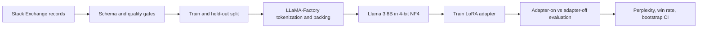

# Project 1 Background: Efficient LLM Fine-Tuning

This guide explains the concepts behind the Llama 3 8B fine-tuning notebook for
a computer engineering graduate student who understands machine learning,
linear algebra, and GPU programming but may be new to modern LLM adaptation.

## Learning Goals

After reading this guide, you should be able to explain:

1. What supervised fine-tuning changes in an autoregressive language model.
2. Why LoRA and QLoRA make an 8B model trainable on one GPU.
3. How data quality, masking, packing, and mixed precision affect training.
4. Why the project compares adapter-on and adapter-off likelihood.
5. What a perplexity improvement does and does not prove.

## System Overview



The base model weights remain frozen. Training learns a small adapter, and the
evaluation can disable that adapter to recover the controlled base-model
condition.

## 1. Autoregressive Language Modeling

An autoregressive LLM estimates the probability of a token sequence by
factorizing it from left to right:

$$
p(x_1,\ldots,x_T)=\prod_{t=1}^{T}p(x_t\mid x_{<t})
$$

The model converts tokens into vectors, applies transformer layers, and produces
logits for the next token. A softmax converts those logits into a probability
distribution.

Training normally minimizes token-level negative log-likelihood:

$$
\mathcal{L}_{NLL}
=-\frac{1}{N}\sum_{i=1}^{N}\log p_\theta(y_i\mid x,y_{<i})
$$

Here, \(x\) is the instruction and question, while \(y_i\) is an answer token.
The parameters \(\theta\) include the frozen base model plus the trainable
adapter parameters.

## 2. Supervised Fine-Tuning

Pretraining teaches broad language and world patterns. Supervised fine-tuning
(SFT) teaches a model to follow a desired input-output format and answer style.

This project uses records with four fields:

```json
{
  "instruction": "Answer the software-engineering question accurately.",
  "input": "The user question",
  "output": "The reference answer",
  "metadata": {"source_url": "...", "license": "CC BY-SA 4.0"}
}
```

The chat template converts these fields into model-specific user and assistant
tokens. During answer-only evaluation, prompt tokens receive label `-100`, so
PyTorch excludes them from the loss. This prevents a long prompt from dominating
the metric.

## 3. Data Quality and Leakage Control

Fine-tuning quality is constrained by the training data. The notebook performs:

- Required-field validation.
- Empty-answer rejection.
- Maximum-length filtering.
- Exact deduplication.
- A deterministic held-out split before training registration.
- Atomic cache replacement so an interrupted download is not treated as valid.

The run started with 50,500 records. It retained 49,693 training examples and
500 held-out examples while rejecting 307 rows.

The held-out set must not influence prompt selection, hyperparameter tuning, or
checkpoint selection. Otherwise, the reported improvement becomes optimistically
biased.

## 4. LoRA

Full fine-tuning updates every model weight and requires optimizer state and
gradients for billions of parameters. Low-Rank Adaptation (LoRA) freezes a weight
matrix \(W_0\) and learns a low-rank update:

$$
W = W_0 + \frac{\alpha}{r}BA
$$

where:

- \(W_0 \in \mathbb{R}^{d_{out}\times d_{in}}\) is frozen.
- \(A \in \mathbb{R}^{r\times d_{in}}\) and
  \(B \in \mathbb{R}^{d_{out}\times r}\) are trainable.
- \(r\) is much smaller than the original dimensions.
- \(\alpha/r\) controls the update scale.

Instead of learning \(d_{out}d_{in}\) parameters, LoRA learns approximately
\(r(d_{in}+d_{out})\). This project trained 20,971,520 parameters, about 0.26%
of the full 8.05B-parameter model.

## 5. QLoRA and NF4 Quantization

QLoRA stores the frozen base model in 4-bit form while computing adapter updates
at higher precision. The project uses NormalFloat4 (NF4), which allocates its
limited code points for approximately normally distributed neural weights.

The important separation is:

- Base weights: stored in 4-bit NF4 to reduce memory.
- Matrix operations: computed in BF16 on the A100.
- LoRA parameters and optimizer state: kept at trainable precision.

Double quantization further compresses the quantization constants. Layer-norm
upcasting improves numerical stability during quantized training.

Quantization saves memory but can slightly change the base-model reference.
Therefore, both adapter-on and adapter-off evaluation use the same quantized
base model.

## 6. GPU Efficiency Techniques

### Mixed precision

BF16 has FP32-like exponent range with fewer mantissa bits. It is well supported
by A100 tensor cores and is generally more stable than FP16 for LLM training.

### Gradient accumulation

With micro-batch size \(b\) and accumulation count \(k\), the effective batch
size on one GPU is:

$$
B_{effective}=b\times k
$$

This project uses \(b=2\) and \(k=8\), giving an effective batch size of 16.

### Gradient checkpointing

Checkpointing stores fewer activations during the forward pass and recomputes
some of them during backpropagation. It exchanges additional compute for lower
GPU memory use.

### Sequence packing

Packing places multiple short examples into one fixed-length sequence. It
reduces padding waste and improves token throughput, provided attention and
labels keep examples logically separated.

## 7. Key Training Configuration

| Setting | Value |
| --- | --- |
| Base model | `meta-llama/Meta-Llama-3-8B-Instruct` |
| GPU | One NVIDIA A100-SXM4-40GB |
| Quantization | 4-bit NF4 with double quantization |
| Compute precision | BF16 |
| Sequence cutoff | 2,048 tokens |
| Micro-batch / accumulation | 2 / 8 |
| Effective batch size | 16 |
| Epochs | 1 |
| Learning rate | `2e-4` with cosine decay |
| Optimizer updates | 701 |
| Training runtime | 9,873 seconds, or 2:44:33 |

## 8. Evaluation: NLL and Perplexity

Perplexity is the exponential of average token NLL:

$$
\operatorname{PPL}=\exp(\mathcal{L}_{NLL})
$$

Lower perplexity means the model assigns more probability to the reference
answers. It does not directly measure whether generated code compiles, whether
facts are correct, or whether users prefer the answer.

The paired evaluation computes each held-out example twice:

1. Adapter disabled: quantized base model.
2. Adapter enabled: same model plus the trained LoRA weights.

This controls model revision, tokenizer, quantization, prompt, truncation, and
hardware.

## 9. Paired Win Rate and Bootstrap Interval

For example \(i\), define the improvement:

$$
\Delta_i=NLL_{base,i}-NLL_{tuned,i}
$$

A positive value favors the tuned model. The paired win rate is the fraction of
examples with \(\Delta_i>0\).

Bootstrap evaluation repeatedly samples the paired improvements with
replacement, computes a mean for each sample, and takes percentile bounds. A
95% interval entirely above zero supports a consistent direction of improvement.

The recorded 100-example evaluation produced:

- Base perplexity: 7.9560.
- Tuned perplexity: 5.5359.
- Relative reduction: 30.42%.
- Tuned paired win rate: 100%.
- Mean NLL improvement 95% interval: [0.4751, 0.5900].

## 10. How to Interpret the Result

The result supports this precise statement:

> On a fixed 100-example holdout subset, enabling the trained QLoRA adapter
> reduced answer-only perplexity by 30.42% relative to the same 4-bit base model.

It does not support a generic statement that the tuned model is 30.42% more
accurate. A stronger evaluation would add executable-code tests, factuality
checks, human preference review, safety tests, and all 500 held-out examples.

## 11. Common Failure Modes

- **Training loss decreases but answers do not improve:** the data or objective
  may not represent the desired behavior.
- **Evaluation has zero answer tokens:** the prompt consumed the sequence cutoff;
  reserve answer capacity before truncating the prompt.
- **CUDA is unavailable:** the notebook is attached to a local CPU kernel instead
  of the Colab GPU runtime.
- **HTTP 401 from Hugging Face:** the account lacks accepted model terms or a
  valid read-only token.
- **Out-of-memory errors:** reduce sequence length or micro-batch size, enable
  checkpointing, or verify 4-bit loading.
- **Overstated result:** perplexity improvement is reported as task accuracy.

## Suggested Notebook Reading Order

1. Runtime and dependency checks.
2. Dataset download/cache and schema.
3. Quality gates and held-out split.
4. LLaMA-Factory registration and YAML configuration.
5. Training output and loss curve.
6. Adapter-on versus adapter-off evaluation.
7. FastAPI serving skeleton.

Return to the [Project 1 notebook](../01_llm_fine_tuning_pipeline.ipynb) or the
[Project 1 report](../output/project1/project1_report.pdf) for the executed
implementation and visual results.
