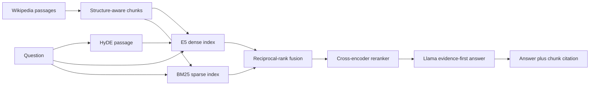

# Project 2 Background: Retrieval-Augmented Generation

This guide introduces the concepts behind the document-QA RAG project for a
computer engineering graduate student. It focuses on how retrieval, ranking,
grounded generation, and controlled evaluation work together.

## Learning Goals

After reading this guide, you should be able to explain:

1. Why an LLM needs retrieval for private or changing knowledge.
2. The difference between dense retrieval, BM25, and cross-encoder reranking.
3. How HyDE and reciprocal-rank fusion improve candidate recall.
4. How citations connect generated claims to retrieved evidence.
5. Why quality gains must be considered together with latency.

## System Overview

The baseline uses only the raw question, E5 embeddings, and FAISS top-3 search.
The advanced system adds the other retrieval stages while keeping the answer
model fixed.

## 1. Why RAG Exists

An LLM stores statistical patterns in its parameters. It does not automatically
know newly published documents, private company files, or the exact source for a
claim. Retrieval-Augmented Generation (RAG) supplies relevant text at inference
time.

A RAG system separates two responsibilities:

- **Retriever:** identify evidence that may answer the question.
- **Generator:** produce an answer using only the supplied evidence.

This separation improves traceability and allows knowledge updates without
retraining the LLM.

## 2. Document Chunking

Embedding an entire long document into one vector can mix unrelated topics.
Chunking divides documents into retrieval units.

The project uses a recursive splitter that prefers paragraph and sentence
boundaries before hard character cuts:

- Chunk size: 900 characters.
- Overlap: 120 characters.
- Total chunks: 3,492.

Overlap protects facts near a boundary, but excessive overlap increases index
size and can return near-duplicate evidence. Stable chunk IDs make citations and
evaluation repeatable.

## 3. Dense Retrieval

A dense encoder maps text into a vector:

$$
f_\theta(text)\in\mathbb{R}^{d}
$$

After normalization, cosine similarity is the dot product:

$$
s(q,d)=\frac{f(q)\cdot f(d)}{\|f(q)\|\|f(d)\|}
$$

Dense retrieval is useful when question and document use different words with
similar meaning. The project uses `intfloat/e5-small-v2` and an exact FAISS
inner-product index.

The baseline retrieves the three chunks with highest dense similarity to the raw
question.

## 4. Sparse Retrieval with BM25

Dense vectors can miss exact names, error codes, dates, and rare terms. BM25
uses lexical token matching with term-frequency saturation and document-length
normalization.

A common BM25 form is:

$$
\operatorname{BM25}(q,d)=
\sum_{t\in q}IDF(t)
\frac{f(t,d)(k_1+1)}
{f(t,d)+k_1(1-b+b|d|/\operatorname{avgdl})}
$$

where:

- \(f(t,d)\) is the count of term \(t\) in document \(d\).
- \(IDF(t)\) gives more weight to rare terms.
- \(k_1\) controls term-frequency saturation.
- \(b\) controls document-length normalization.

Dense and sparse retrieval fail in different ways, which makes them
complementary.

## 5. HyDE Query Expansion

Hypothetical Document Embeddings (HyDE) asks an LLM to draft a short passage
that could answer the question. The system embeds that passage with the query.

Why it can help:

- Questions are often short and underspecified.
- Documents are written in passage style.
- A hypothetical answer introduces likely terminology and context.

HyDE does not need to be factually correct because it is used for retrieval, not
as final evidence. However, a poor hypothetical passage can cause query drift,
and generating it adds latency.

## 6. Reciprocal-Rank Fusion

Dense and BM25 raw scores have different scales. Reciprocal-Rank Fusion (RRF)
combines rank positions instead of raw scores:

$$
\operatorname{RRF}(d)=
\sum_{j=1}^{m}\frac{1}{k+\operatorname{rank}_j(d)}
$$

where \(m\) is the number of ranked lists and \(k\) dampens the influence of the
top position. A document ranked highly by either retriever receives a strong
score; agreement increases it further.

The project gathers 20 candidates from each retrieval path, fuses them, and
keeps 20 candidates for reranking.

## 7. Cross-Encoder Reranking

A bi-encoder computes question and document vectors independently, which makes
large-scale retrieval fast. A cross-encoder jointly reads the question and one
candidate chunk:

$$
s_{cross}(q,d)=g_\phi([q;d])
$$

Joint attention models detailed token interactions and usually improves ranking
precision. It is more expensive because every question-candidate pair needs a
forward pass.

The project uses `cross-encoder/ms-marco-MiniLM-L-6-v2` and returns the top five
reranked chunks.

## 8. Evidence-First Generation and Citations

The same Llama 3 8B NF4 model answers for both systems. This controls model size
and decoding behavior so quality differences are attributable mainly to
retrieval and prompting.

The advanced prompt instructs the model to:

1. Select evidence internally.
2. Return a concise answer.
3. Cite a supplied chunk ID.
4. Avoid exposing a long reasoning trace.

A citation is valid only when its chunk ID belongs to the context actually
provided to the model. Citation validity does not by itself prove that the cited
text entails every claim.

## 9. Evaluation Metrics

### Answer-hit at k

Because the dataset has no gold passage IDs, a retrieved set counts as a hit when
at least one chunk contains the normalized reference answer:

$$
\operatorname{Hit@k}=
\mathbb{1}[\exists d\in R_k(q): answer\subseteq d]
$$

This is transparent but can miss paraphrases and can reward accidental text
matches.

### Reciprocal rank

If the first answer-bearing chunk appears at rank \(r\):

$$
RR=\frac{1}{r}
$$

Mean reciprocal rank rewards systems that place useful evidence earlier.

### Token F1

Let \(P\) be generated-answer tokens and \(G\) be reference-answer tokens:

$$
Precision=\frac{|P\cap G|}{|P|},\quad
Recall=\frac{|P\cap G|}{|G|}
$$

$$
F1=\frac{2\cdot Precision\cdot Recall}{Precision+Recall}
$$

Token F1 is easy to audit but under-credits valid paraphrases.

### Composite score

The project uses a declared weighted score:

$$
S=0.25H+0.15MRR+0.45F1+0.15C
$$

where \(H\) is answer-hit, \(C\) is citation validity, and higher is better. The
weights make answer quality important while retaining retrieval and citation
signals.

## 10. Controlled Experiment

Both systems share:

- Dataset revision and corpus.
- Chunking and evaluation questions.
- Llama generator and quantization.
- Decoding and metric code.
- NVIDIA A100-SXM4-40GB hardware.

Only retrieval and answer-prompt design differ. This makes the comparison more
defensible than comparing two systems that also use different generators.

## 11. Key Configuration and Results

| Item | Baseline | Advanced |
| --- | --- | --- |
| Retrieval | Raw-question E5 | HyDE + E5 + BM25 + RRF + reranker |
| Returned chunks | 3 | 5 |
| Candidate depth | 3 | 20 dense + 20 sparse |
| Answer-hit | 0.833 | 0.933 |
| Reciprocal rank | 0.792 | 0.881 |
| Token F1 | 0.317 | 0.409 |
| Citation validity | 0.650 | 0.783 |
| Composite score | 0.567 | 0.667 |
| Seconds/question | 0.805 | 1.749 |

The advanced system improved the composite score by 17.55% but required about
2.17 times the end-to-end latency. The result supports advanced retrieval for
quality-sensitive QA, while the baseline remains attractive for low-latency or
low-cost workloads.

## 12. Common Failure Modes

- **Relevant document is missing:** chunking, retrieval depth, or query expansion
  may be poor.
- **Correct evidence is retrieved but answer is wrong:** generation or context
  ordering is the bottleneck.
- **Valid citation but unsupported claim:** citation syntax passed, but entailment
  was not verified.
- **High answer-hit and low F1:** generation may be verbose or paraphrased.
- **HyDE hurts retrieval:** the hypothetical passage drifted from the question.
- **Latency is too high:** cache HyDE, batch reranking, reduce candidate depth, or
  use approximate nearest-neighbor search.

## Suggested Notebook Reading Order

1. Pinned dataset loading and local caching.
2. Chunk creation and stable IDs.
3. E5 embeddings, FAISS, and BM25 indexes.
4. Shared Llama generator loading.
5. Baseline and advanced retrieval functions.
6. Per-example evaluation and saved result markers.
7. Optional provider benchmark.

Return to the [Project 2 notebook](../02_rag_document_qa_system.ipynb) or the
[Project 2 report](../output/project2/project2_report.pdf) for the executed
implementation and visual comparison.
