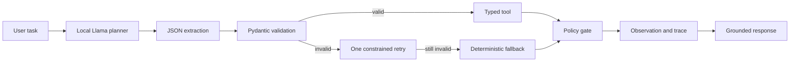

# Project 3 Background: LLM Agents, Tools, MCP, and Multi-Agent Workflows

This guide explains the concepts behind the local LangChain and CrewAI project
for a computer engineering graduate student. The central idea is that an LLM
proposes actions, while deterministic software owns permissions, validation, and
side effects.

## Learning Goals

After reading this guide, you should be able to explain:

1. The difference between an LLM call, a workflow, and an agent.
2. Why typed tool schemas and deterministic policy gates matter.
3. What an MCP-style tool contract contains.
4. How retries and fallbacks recover malformed model output.
5. Why multiple agents can improve quality while increasing latency and cost.

## System Overview



The separate CrewAI path uses four sequential roles:


## 1. LLM Calls, Workflows, and Agents

An ordinary LLM call maps a prompt to text. A workflow executes a predefined
sequence of steps. An agent lets a model select an action based on the current
task and observations.

An agent loop can be summarized as:

$$
a_t=\pi_\theta(s_t),\qquad
o_t=T(a_t),\qquad
s_{t+1}=f(s_t,a_t,o_t)
$$

where:

- \(s_t\) is the current state or conversation.
- \(\pi_\theta\) is the LLM policy.
- \(a_t\) is a proposed action.
- \(T\) is a deterministic tool or environment.
- \(o_t\) is the observation returned by the tool.

The LLM is probabilistic. Tools and policy gates should be deterministic whenever
possible.

## 2. Structured Tool Decisions

Free-form text such as "I will search the database" is difficult for software to
execute safely. The planner instead returns a structured decision:

```json
{
  "tool": "search_knowledge_base",
  "arguments": {
    "query": "primary buyers",
    "top_k": 2
  }
}
```

Pydantic checks:

- Tool name belongs to an allowed set.
- Required fields exist.
- Field types are correct.
- Numeric and string constraints are satisfied.
- Unexpected structure is rejected.

Validation converts an unreliable text interface into a typed software boundary.

## 3. Tool Design

The project implements three capabilities:

| Tool | Behavior | Side effects |
| --- | --- | --- |
| `search_knowledge_base` | BM25 search over four local Markdown files | Read-only |
| `calculate_campaign_budget` | Deterministic multiplication and cap check | Read-only |
| `save_workspace_report` | Writes an approved Markdown report | Filesystem write |

The budget tool demonstrates why arithmetic should be code rather than LLM text:

$$
Budget_{total}=weeks\times Budget_{weekly}
$$

The model chooses when to call the tool, but ordinary Python computes the value.

## 4. Safety and the Reference Monitor

A reference monitor is a small, always-invoked component that decides whether an
operation is allowed. For the writer tool, the policy checks:

- `confirm_write` is explicitly true.
- The filename satisfies the schema.
- The resolved destination remains inside the approved output directory.
- Path traversal such as `../` is rejected.

The key rule is:

$$
\operatorname{allow}(action)
=schema\_valid\land authorized\land path\_confined
$$

The LLM cannot override this Boolean decision through persuasive text.

## 5. Grounding and Citations

Search returns source-tagged evidence. The answer prompt instructs the model to
answer only from that evidence and cite a filename.

If the model claims insufficient evidence even when the retrieved text contains
a direct answer, the controller applies a conservative extractive fallback. This
keeps the final answer grounded without allowing unsupported invention.

Citation presence is only a first control. A production system should also test
whether every claim is entailed by the cited source.

## 6. Malformed JSON, Retry, and Fallback

Local LLMs do not always produce valid JSON. The controller uses three layers:

1. Extract the first plausible JSON object.
2. Validate it and retry once with a stricter correction prompt.
3. Apply deterministic keyword routing if validation still fails.

If \(V\) is the event that the planner emits valid JSON and \(F\) is the event
that fallback routes correctly, task success can exceed native JSON validity:

$$
P(success)=P(V)P(success\mid V)
+P(\neg V)P(F\mid\neg V)
$$

In the recorded run, planner valid-JSON rate was 66.7%, while end-to-end task
success was 100%. The difference is the contribution of validation, retry, and
fallback.

## 7. Execution Traces

Each tool call records:

- Tool name.
- Validated arguments.
- Status.
- Latency.
- Returned observation or blocked reason.

Traces support debugging, auditing, latency analysis, and replay. They should not
record secrets or unnecessary customer data.

## 8. MCP-Style Tool Contracts

The Model Context Protocol (MCP) standardizes how clients discover and invoke
tools exposed by a server. A tool description commonly includes:

- Stable tool name.
- Human-readable description.
- JSON Schema input contract.
- Structured output contract.
- Annotations about read-only, destructive, idempotent, or open-world behavior.

This notebook uses an in-process MCP-style manifest rather than a network MCP
transport. The schemas and dispatcher demonstrate the contract boundary, while a
future version can expose the same logic through a real MCP server.

## 9. Multi-Agent Role Decomposition

A single prompt must research, plan, criticize, and edit simultaneously. CrewAI
assigns these objectives to separate roles:

1. **Researcher:** extracts source-tagged facts.
2. **Strategist:** proposes positioning, channels, timeline, and targets.
3. **Critic:** identifies unsupported claims, missing controls, and constraint
   violations.
4. **Editor:** incorporates corrections into the final memo.

Role decomposition can improve focus and make intermediate artifacts inspectable.
It also repeats model inference and passes longer contexts between roles.

## 10. Agent Evaluation

The 12 deterministic cases cover:

- Knowledge-base search.
- Budget calculation.
- Approved report writes.
- Denied writes.
- Path traversal attempts.
- Unsupported questions.

For \(N\) cases, routing accuracy is:

$$
Accuracy_{route}=
\frac{1}{N}\sum_{i=1}^{N}\mathbb{1}[\hat{t}_i=t_i]
$$

Similar rates are computed for task success, valid JSON, citations, and safety
blocks. Median latency describes a typical request; p95 latency describes the
slow tail.

Recorded local-agent results:

| Metric | Result |
| --- | ---: |
| Routing accuracy | 100% |
| Planner valid JSON | 66.7% |
| Task success | 100% |
| Search citation rate | 100% |
| Safety-block rate | 100% |
| Median / p95 latency | 4.86 s / 7.24 s |

## 11. Strategy Rubric and Relative Improvement

The project scores source citations, audience, channels, four-week timeline,
measurable KPIs, safeguards, and risk mitigation.

Relative improvement is:

$$
Improvement(\%)=
\frac{S_{crew}-S_{single}}{S_{single}}\times 100
$$

With \(S_{single}=50.0\) and \(S_{crew}=67.86\), the improvement is 35.71%.

This is a lexical, deterministic rubric, not a human judgment of business
quality. The CrewAI memo still received zero KPI credit under the strict matching
rules, which reveals an important remaining weakness.

## 12. Compute and Latency Tradeoff

| Path | Recorded time |
| --- | ---: |
| Single-agent strategy | 29.23 seconds |
| Four-role CrewAI strategy | 133.88 seconds |
| CrewAI slowdown | About 4.58x |

The multi-agent workflow is reasonable for an asynchronous, high-value planning
task. It is inefficient for a low-latency chat turn unless roles are parallelized,
cached, shortened, or assigned to smaller models.

## 13. Security Threats to Agent Systems

### Prompt injection

Retrieved text can contain instructions that conflict with system policy. Treat
retrieved content as untrusted data, not executable authority.

### Indirect tool abuse

A malicious document may ask the model to write a file or reveal data. Side
effects must still pass schema and permission checks.

### Data exfiltration

Tools should expose only required fields, and traces should redact secrets and
customer PII.

### Excessive agency

Use least privilege, explicit approval, timeouts, call budgets, and bounded
iteration counts. A model should not receive a general shell or unrestricted
filesystem tool when narrower capabilities are sufficient.

## 14. Key Project Configuration

| Setting | Value |
| --- | --- |
| Model | Local `meta-llama/Meta-Llama-3-8B-Instruct` |
| GPU and precision | A100 40GB, 4-bit NF4 with BF16 compute |
| Seed | 2026 |
| Planner / answer budget | 100 / 120 new tokens |
| Retry policy | One JSON retry, then deterministic fallback |
| Crew process | Sequential, maximum three iterations per role |
| Role token budgets | 300 / 500 / 400 / 750 |
| Local generation calls | 35 |

## Suggested Notebook Reading Order

1. Local model and knowledge-base setup.
2. Pydantic tool schemas and implementations.
3. Planner, validation, retry, and fallback.
4. MCP-style manifest and dispatcher.
5. CrewAI adapter and four role definitions.
6. Agent test suite and strategy rubric.
7. Saved traces, summaries, samples, and memo.

Return to the [Project 3 notebook](../03_llm_agent_system.ipynb) or the
[Project 3 report](../output/project3/project3_report.pdf) for the executed
implementation and measured comparison.
